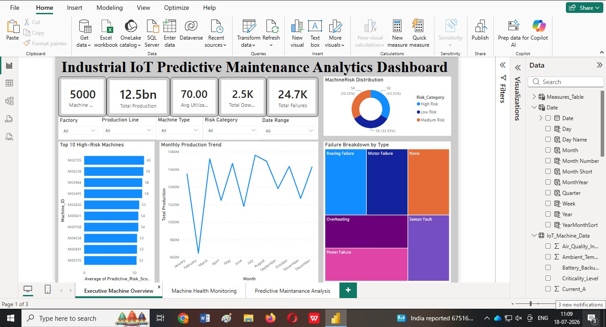
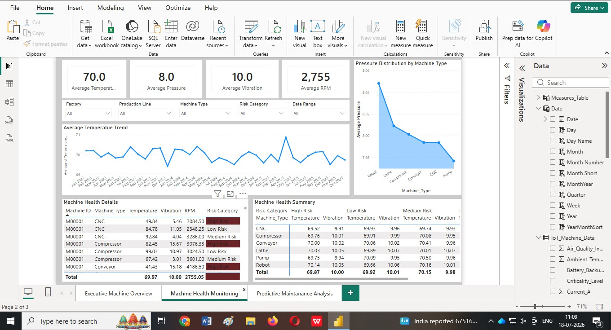
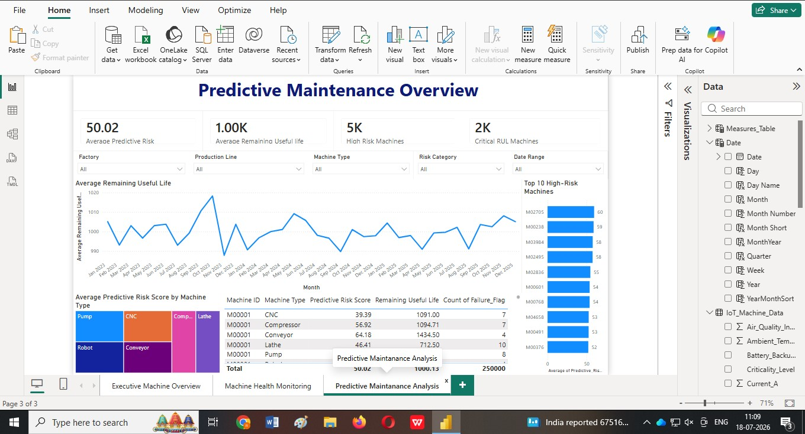

# 🚀 Industrial IoT Predictive Maintenance Analytics Dashboard

## 📌 Project Overview

This project presents an **Industrial IoT Predictive Maintenance Analytics Dashboard** developed in **Microsoft Power BI** to help manufacturing organizations monitor machine health, reduce unexpected downtime, and improve operational efficiency through data-driven insights.

The dashboard transforms raw Industrial IoT sensor data into interactive visualizations that enable maintenance teams and decision-makers to identify high-risk machines, optimize maintenance schedules, and improve production performance.

---

## 🎯 Business Problem

Manufacturing facilities often experience unexpected machine failures that lead to:

- Unplanned production downtime
- Increased maintenance costs
- Reduced operational efficiency
- Lower equipment utilization
- Delayed production schedules

Traditional reactive maintenance is expensive and inefficient.

This dashboard provides a predictive approach by continuously monitoring machine performance indicators and highlighting equipment that requires attention before failure occurs.

---

## 🎯 Project Objectives

- Monitor machine performance in real time
- Identify equipment with high failure risk
- Analyze production efficiency
- Track machine utilization
- Reduce unplanned downtime
- Support predictive maintenance decisions

---

# 📊 Dashboard Pages

## 1️⃣ Executive Machine Overview

Provides an executive summary of the manufacturing operation including:

- Total Production
- Machine Utilization
- Efficiency Score
- Downtime Hours
- Failure Rate
- Remaining Useful Life
- Predictive Risk Score

---

## 2️⃣ Machine Health Monitoring

Monitors key Industrial IoT sensor parameters including:

- Temperature
- Pressure
- RPM
- Torque
- Power Consumption
- Voltage
- Current
- Vibration

This page helps identify abnormal machine behaviour before failures occur.

---

## 3️⃣ Predictive Maintenance Dashboard

Analyzes maintenance risk using predictive indicators such as:

- Failure Flag
- Predictive Risk Score
- Remaining Useful Life (RUL)
- High-risk machine identification

Supports proactive maintenance planning and resource allocation.

---

# 📈 Key Performance Indicators (KPIs)

- Production Count
- Machine Utilization %
- Efficiency Score
- Downtime Hours
- Failure Count
- Predictive Risk Score
- Remaining Useful Life
- Machine Health Metrics

---

# 🛠 Tools & Technologies

- Microsoft Power BI
- Power Query
- DAX
- Microsoft Excel / CSV
- Industrial IoT Dataset

---

# 📂 Repository Structure

```
Industrial-IoT-Predictive-Maintenance-Dashboard
│
├── Dashboard
│   └── Industrial_IoT_Predictive_Maintenance.pbix
│
├── Dataset
│   ├── Industrial_Machine_Data.csv
│   └── Data_Dictionary.csv
│
├── Images
│   ├── Dashboard_Overview.jpg
│   ├── Machine_Health.jpg
│   └── Predictive_Maintenance.jpg
│
├── Documentation
│
├── LICENSE
└── README.md
```

---

# 📸 Dashboard Preview

## Executive Dashboard



---

## Machine Health Dashboard



---

## Predictive Maintenance Dashboard


---

# 📊 Business Insights

The dashboard enables stakeholders to:

- Detect high-risk machines before failure
- Improve maintenance planning
- Reduce production downtime
- Monitor operational efficiency
- Increase machine utilization
- Make informed maintenance decisions using interactive dashboards

---

# 💡 Skills Demonstrated

- Data Cleaning
- Data Modeling
- Data Visualization
- DAX Measures
- KPI Development
- Dashboard Design
- Business Intelligence
- Industrial Analytics
- Predictive Maintenance Analytics

---

# 🚀 Future Improvements

Potential enhancements include:

- Machine Learning failure prediction
- Real-time IoT streaming
- Automated maintenance alerts
- Power BI Service deployment
- Mobile dashboard optimization

---

# 👨‍💻 About Me

**Edwina Binoy**

Mechanical Engineer transitioning into **Data Analytics** and **Business Intelligence**.

Passionate about transforming data into actionable business insights through interactive dashboards and analytics solutions.

## Skills

- Power BI
- SQL
- Microsoft Excel
- DAX
- Data Analysis
- Business Intelligence
- Mechanical Engineering

---

## 📬 Connect With Me

**LinkedIn:** *https://www.linkedin.com/in/edwina-binoy/*

**GitHub:** https://github.com/EdwinaBinoy